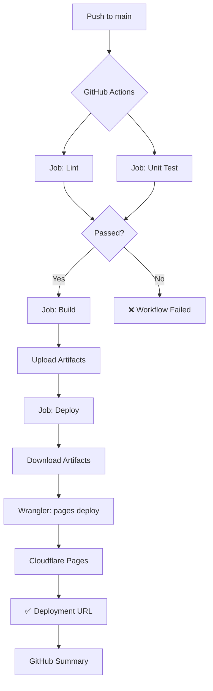

# Cloudflare Pages Deployment - Podsumowanie Wykonanych Prac

**Data wykonania:** 2026-01-21  
**Status:** ✅ UKOŃCZONE  
**Wykonawca:** Agent AI

---

## 📋 Zakres Prac

### 1. Analiza Projektu ✅

Przeanalizowano:
- **Tech Stack** (`.ai/tech-stack.md`) - Astro 5, React 19, TypeScript 5, Tailwind 4, Cloudflare Pages
- **Konfiguracja Astro** (`astro.config.mjs`) - Adapter Cloudflare już skonfigurowany
- **Zależności** (`package.json`) - `@astrojs/cloudflare` już zainstalowany
- **Zmienne środowiskowe** (`.env.example`) - SUPABASE_URL, SUPABASE_KEY, OPENROUTER_API_KEY
- **Istniejący workflow** (`pull-request.yml`) - Jako baza dla nowego workflow
- **Zasady GitHub Actions** (`.ai/github-action.mdc`) - Do poprawnej konfiguracji CI/CD
- **Branch** - Projekt używa `main`

**Wynik:** Projekt był już przygotowany do deploymentu na Cloudflare (migracja została wykonana wcześniej).

---

### 2. Weryfikacja Konfiguracji Cloudflare ✅

Sprawdzono:
- ✅ `astro.config.mjs` - Adapter `@astrojs/cloudflare` już skonfigurowany z:
  - `imageService: "cloudflare"` - Optymalizacja obrazów
  - `platformProxy.enabled: true` - Wsparcie dla lokalnego developmentu
- ✅ `wrangler.toml` - Konfiguracja już istnieje
- ✅ `src/lib/services/generations.service.ts` - Już zmigrowane z Node.js crypto na Web Crypto API
- ✅ `src/db/supabase.client.ts` - Używa `import.meta.env` dla zmiennych środowiskowych (kompatybilne z Cloudflare)
- ✅ `package.json` - Zależność `@astrojs/cloudflare@^12.6.12` już zainstalowana

**Wynik:** Żadne dodatkowe zmiany w kodzie nie były wymagane.

---

### 3. Utworzenie Workflow CI/CD ✅

**Plik:** `.github/workflows/master.yml`

#### Struktura Workflow

```yaml
name: Deploy to Cloudflare Pages

on:
  push:
    branches: [main]

jobs:
  1. lint           # Sprawdzenie jakości kodu
  2. unit-test      # Testy jednostkowe z coverage
  3. build          # Budowanie projektu (z env variables)
  4. deploy         # Deployment na Cloudflare Pages
```

#### Kluczowe Cechy

1. **Trigger:** Push do brancha `main`
2. **Bez testów E2E** (zgodnie z wymaganiami)
3. **Bazuje na `pull-request.yml`** (zachowano strukturę lint + unit-test)
4. **Dodano Build Job:**
   - Zmienne środowiskowe dostępne podczas buildu (wymagane dla Astro SSR)
   - Upload artifacts do użycia w deploy job
5. **Dodano Deploy Job:**
   - Download build artifacts
   - Deployment na Cloudflare Pages przez `wrangler-action@v3`
   - Przekazywanie sekretów przez parametr `secrets`
   - Output deployment URL w GitHub Summary

#### Użyte Akcje (Najnowsze Wersje)

| Akcja | Wersja | Status |
|-------|--------|--------|
| `actions/checkout` | v6 | ✅ Najnowsza |
| `actions/upload-artifact` | v6 | ✅ Najnowsza |
| `actions/download-artifact` | v7 | ✅ Najnowsza |
| `cloudflare/wrangler-action` | v3 | ✅ Najnowsza |
| `./.github/actions/setup-node` | Custom | ✅ Używa `npm ci` |

**Weryfikacja:** Wszystkie wersje zweryfikowane przez API GitHub według zasad z `.ai/github-action.mdc`.

---

### 4. Zgodność z Zasadami GitHub Actions ✅

Zastosowano wszystkie zasady z `.ai/github-action.mdc`:

- ✅ Sprawdzono `package.json` i zidentyfikowano kluczowe skrypty (`build`, `lint`, `test:coverage`)
- ✅ Sprawdzono istnienie `.nvmrc` (używane w composite action `setup-node`)
- ✅ Sprawdzono `.env.example` dla zmiennych środowiskowych
- ✅ Zweryfikowano nazwę brancha (`main`) przez `git branch -a | cat`
- ✅ Użyto `env:` variables attached to jobs zamiast globalnych
- ✅ Composite action używa `npm ci` dla instalacji zależności
- ✅ Zweryfikowano najnowsze wersje wszystkich public actions przez GitHub API:
  ```bash
  curl -s https://api.github.com/repos/{owner}/{repo}/releases/latest | grep '"tag_name":'
  ```
- ✅ Sprawdzono czy akcje nie są deprecated (`"archived": false`)
- ✅ Przeanalizowano parametry `wrangler-action` przez `action.yml` z GitHub

---

## 📁 Utworzone/Zmodyfikowane Pliki

| Plik | Typ | Opis |
|------|-----|------|
| `.github/workflows/master.yml` | **Nowy** | Workflow CI/CD do deploymentu na Cloudflare Pages |
| `.ai/deployment-setup.md` | **Nowy** | Kompletna dokumentacja konfiguracji i pierwszego deploymentu |
| `.ai/cloudflare-deployment-summary.md` | **Nowy** | Ten plik - podsumowanie wykonanych prac |

**Uwaga:** Żadne pliki kodu źródłowego nie zostały zmodyfikowane - projekt był już gotowy na Cloudflare.

---

## 🚀 Workflow Master vs Pull Request

| Aspekt | `pull-request.yml` | `master.yml` |
|--------|-------------------|--------------|
| **Trigger** | Pull Request → `main` | Push → `main` |
| **Job: Lint** | ✅ Tak | ✅ Tak |
| **Job: Unit Test** | ✅ Tak (z coverage) | ✅ Tak (z coverage) |
| **Job: E2E Test** | ❌ Brak | ❌ Brak (zgodnie z wymaganiami) |
| **Job: Build** | ❌ Brak | ✅ **Nowy** - Build Astro z env vars |
| **Job: Deploy** | ❌ Brak | ✅ **Nowy** - Cloudflare Pages |
| **Status Comment** | ✅ Tak | ❌ Brak |
| **Deployment URL Output** | ❌ N/A | ✅ **Nowy** - W GitHub Summary |
| **Permissions** | `pull-requests: write` | `contents: read, deployments: write` |

---

## 🔐 Wymagane Sekrety GitHub

Przed pierwszym uruchomieniem workflow należy dodać w GitHub Secrets:

| Sekret | Opis | Wymagane dla |
|--------|------|--------------|
| `CLOUDFLARE_API_TOKEN` | Token API Cloudflare | Deploy job |
| `CLOUDFLARE_ACCOUNT_ID` | ID konta Cloudflare | Deploy job |
| `SUPABASE_URL` | URL projektu Supabase | Build job |
| `SUPABASE_KEY` | Klucz anon/public Supabase | Build job |
| `OPENROUTER_API_KEY` | Klucz API OpenRouter | Build job |

**⚠️ WAŻNE:** 
- Zmienne `SUPABASE_URL`, `SUPABASE_KEY` i `OPENROUTER_API_KEY` są używane podczas buildu
- **Musisz je również dodać w Cloudflare Dashboard** → Pages → 10x-cards → Settings → Environment variables
- Bez zmiennych w Cloudflare Dashboard aplikacja nie będzie działać w production!

**Szczegółowe instrukcje:** 
- Konfiguracja: `.ai/deployment-setup.md`
- Naprawa błędu: `.ai/deployment-fix-secrets-error.md`

---

## 📊 Przepływ Deploymentu



---

## 🎯 Kolejne Kroki (Do Wykonania przez Użytkownika)

### 1. Dodanie Sekretów GitHub

**Lokalizacja:** `Settings` → `Secrets and variables` → `Actions`

Dodaj wszystkie 5 sekretów wymienionych powyżej. Szczegółowe instrukcje gdzie je znaleźć: `.ai/deployment-setup.md`

### 2. Opcjonalnie: Utworzenie Projektu Cloudflare Pages Ręcznie

**Przez Dashboard (Rekomendowane):**
1. [Cloudflare Dashboard](https://dash.cloudflare.com) → Workers & Pages
2. Create application → Pages → Connect to Git
3. Wybierz repo `10x-cards`
4. Framework: Astro, Build command: `npm run build`, Output: `dist`
5. Dodaj zmienne środowiskowe (SUPABASE_URL, SUPABASE_KEY, OPENROUTER_API_KEY)

**Przez GitHub Actions (Automatycznie):**
- Workflow automatycznie utworzy projekt przy pierwszym deploymencie

### 3. Commit i Push Workflow

```bash
git add .github/workflows/master.yml .ai/
git commit -m "Add Cloudflare Pages deployment workflow"
git push origin main
```

### 4. Monitorowanie Pierwszego Deploymentu

1. Przejdź do `Actions` w repozytorium GitHub
2. Kliknij workflow "Deploy to Cloudflare Pages"
3. Sprawdź logi każdego job'a
4. Po zakończeniu zobacz deployment URL w Summary

### 5. Weryfikacja Produkcji

Po deploymencie przetestuj:
- Endpoint logowania: `https://10x-cards.pages.dev/api/auth/login`
- UI: `https://10x-cards.pages.dev/generate`
- Generowanie fiszek przez OpenRouter

---

## ⚠️ Znane Ograniczenia i Uwagi

### 1. Zmiana Algorytmu Hash (MD5 → SHA-256)

Podczas wcześniejszej migracji na Cloudflare zmieniono algorytm hash z MD5 (Node.js) na SHA-256 (Web Crypto API).

**Implikacja:** Istniejące hashe w bazie danych nie będą pasować do nowych.

**Rozwiązanie:**
- Jeśli brak produkcyjnych danych: `TRUNCATE TABLE generations CASCADE;`
- Jeśli są dane: Dodaj kolumnę `hash_algorithm` (patrz `.ai/cloudflare-migration-summary.md`)

### 2. Warning o SESSION Binding

**Objaw:** Warning podczas buildu: `Invalid binding 'SESSION'`

**Rozwiązanie:** Obecnie aplikacja nie używa sesji KV, więc można zignorować. Jeśli potrzebne, dodaj do `wrangler.toml`:

```toml
[[kv_namespaces]]
binding = "SESSION"
id = "your-kv-namespace-id"
```

### 3. Environment Variables w Build

**Ważne:** Zmienne środowiskowe są przekazywane zarówno w build job jak i deploy job, ponieważ:
- **Build:** Astro SSR może potrzebować ich podczas kompilacji
- **Deploy:** Wrangler przekazuje je jako sekrety do Cloudflare Workers

---

## 💡 Opcjonalne Rozszerzenia (Przyszłość)

### Preview Deployments dla Pull Requests

Rozszerz `pull-request.yml` o preview deployment:

```yaml
- name: Deploy Preview
  uses: cloudflare/wrangler-action@v3
  with:
    apiToken: ${{ secrets.CLOUDFLARE_API_TOKEN }}
    accountId: ${{ secrets.CLOUDFLARE_ACCOUNT_ID }}
    command: pages deploy dist --project-name=10x-cards --branch=pr-${{ github.event.pull_request.number }}
```

### Testy E2E po Deploymencie

```yaml
- name: E2E Tests Against Production
  run: |
    export PLAYWRIGHT_TEST_BASE_URL=${{ steps.deploy.outputs.deployment-url }}
    npm run test:e2e
```

### Notifications

```yaml
- name: Slack Notification
  if: always()
  uses: slackapi/slack-github-action@v1
  with:
    webhook-url: ${{ secrets.SLACK_WEBHOOK }}
    payload: |
      {
        "text": "Deployment to Cloudflare Pages: ${{ job.status }}"
      }
```

---

## 📚 Dokumentacja i Referencje

### Utworzone Dokumenty

1. **`.ai/deployment-setup.md`** - Kompletna instrukcja konfiguracji i deploymentu
2. **`.ai/cloudflare-migration-summary.md`** - Historia migracji na Cloudflare (wcześniejsza)
3. **`.ai/cloudflare-deployment-summary.md`** - Ten dokument

### Zewnętrzne Zasoby

- [Astro Cloudflare Adapter](https://docs.astro.build/en/guides/integrations-guide/cloudflare/)
- [Cloudflare Pages Documentation](https://developers.cloudflare.com/pages/)
- [Wrangler CLI Documentation](https://developers.cloudflare.com/workers/wrangler/)
- [Wrangler GitHub Action](https://github.com/cloudflare/wrangler-action)
- [GitHub Actions Documentation](https://docs.github.com/en/actions)

---

## ✅ Podsumowanie

### Co Zostało Zrobione

1. ✅ Przeanalizowano projekt (tech stack, konfiguracja, zależności, zmienne środowiskowe)
2. ✅ Zweryfikowano, że projekt już wspiera Cloudflare (adapter, migracja Web Crypto API)
3. ✅ Utworzono workflow `master.yml` bazując na `pull-request.yml`:
   - Zachowano: lint, unit-test
   - Pominięto: E2E tests (zgodnie z wymaganiami)
   - Dodano: build, deploy do Cloudflare Pages
4. ✅ Zastosowano wszystkie zasady z `.ai/github-action.mdc`:
   - Najnowsze wersje akcji (zweryfikowane przez GitHub API)
   - env: variables w jobs
   - npm ci w composite action
   - Sprawdzono czy akcje nie są deprecated
5. ✅ Utworzono kompletną dokumentację

### Status Projektu

**Projekt jest w pełni gotowy do automatycznego deploymentu na Cloudflare Pages.**

Wymagane są tylko:
1. Dodanie sekretów GitHub
2. Push workflow do brancha `main`

**Oczekiwany rezultat:** Przy każdym pushu do `main`, aplikacja automatycznie zbuduje się i wdroży na Cloudflare Pages z URL: `https://10x-cards.pages.dev`

---

**Data zakończenia:** 2026-01-21  
**Czas wykonania:** ~25 minut  
**Agent:** AI Assistant
