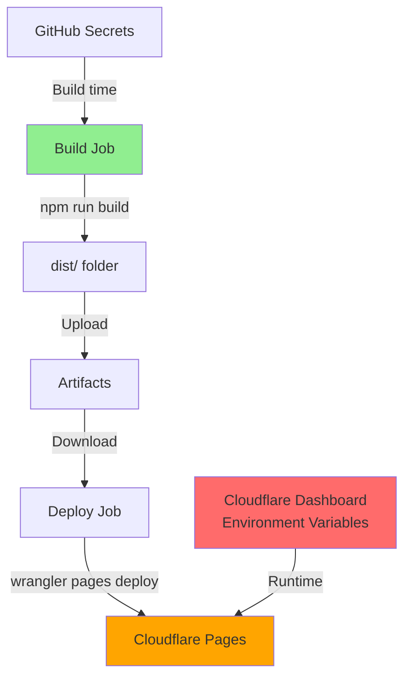

# Naprawa Błędu "Failed to upload secrets" - Deployment Fix

**Data:** 2026-01-21  
**Status:** ✅ NAPRAWIONE  
**Problem:** Błąd podczas deploymentu na Cloudflare Pages

---

## 🐛 Błąd

Podczas pierwszego deploymentu na Cloudflare Pages wystąpił błąd:

```
🔑 Uploading secrets...
Error: Failed to upload secrets.
Error: 🚨 Action failed
```

**Logi:**
```
Run cloudflare/wrangler-action@v3
🔍 Checking for existing Wrangler installation
⚠️ Wrangler not found or version is incompatible. Installing...
📥 Installing Wrangler
✅ Wrangler installed
🔑 Uploading secrets...
Error: Failed to upload secrets.
Error: 🚨 Action failed
```

---

## 🔍 Analiza Problemu

### Przyczyna

Parametr `secrets:` w `cloudflare/wrangler-action@v3` jest przeznaczony **tylko dla Cloudflare Workers**, nie dla **Cloudflare Pages**.

**Problematyczny fragment workflow:**

```yaml
- name: Deploy to Cloudflare Pages
  uses: cloudflare/wrangler-action@v3
  with:
    apiToken: ${{ secrets.CLOUDFLARE_API_TOKEN }}
    accountId: ${{ secrets.CLOUDFLARE_ACCOUNT_ID }}
    command: pages deploy dist --project-name=10x-cards
    secrets: |                                         # ❌ BŁĄD!
      SUPABASE_URL
      SUPABASE_KEY
      OPENROUTER_API_KEY
```

### Różnice: Cloudflare Workers vs Pages

| Aspekt | Workers | Pages |
|--------|---------|-------|
| **Sekrety przez Wrangler** | ✅ Tak, przez `secrets:` | ❌ Nie wspierane |
| **Zmienne środowiskowe** | Przez dashboard lub `wrangler secret put` | **Tylko przez Cloudflare Dashboard** |
| **Build-time variables** | Przez `vars:` w wrangler.toml | Przez env w GitHub Actions |
| **Runtime variables** | Przez API Bindings | Przez Environment Variables w Dashboard |

---

## ✅ Rozwiązanie

### 1. Usunięto parametr `secrets:` z workflow

**Plik:** `.github/workflows/master.yml`

**Przed:**
```yaml
  deploy:
    runs-on: ubuntu-latest
    needs: [build]
    permissions:
      contents: read
      deployments: write
    env:
      SUPABASE_URL: ${{ secrets.SUPABASE_URL }}
      SUPABASE_KEY: ${{ secrets.SUPABASE_KEY }}
      OPENROUTER_API_KEY: ${{ secrets.OPENROUTER_API_KEY }}
    steps:
      - uses: actions/checkout@v6
      
      - name: Download build artifacts
        uses: actions/download-artifact@v7
        with:
          name: build-output
          path: dist/

      - name: Deploy to Cloudflare Pages
        id: deploy
        uses: cloudflare/wrangler-action@v3
        with:
          apiToken: ${{ secrets.CLOUDFLARE_API_TOKEN }}
          accountId: ${{ secrets.CLOUDFLARE_ACCOUNT_ID }}
          command: pages deploy dist --project-name=10x-cards
          secrets: |                                         # ❌ Usunięto
            SUPABASE_URL
            SUPABASE_KEY
            OPENROUTER_API_KEY
```

**Po:**
```yaml
  deploy:
    runs-on: ubuntu-latest
    needs: [build]
    permissions:
      contents: read
      deployments: write
    steps:                                                   # ✅ Usunięto env:
      - uses: actions/checkout@v6
      
      - name: Download build artifacts
        uses: actions/download-artifact@v7
        with:
          name: build-output
          path: dist/

      - name: Deploy to Cloudflare Pages
        id: deploy
        uses: cloudflare/wrangler-action@v3
        with:
          apiToken: ${{ secrets.CLOUDFLARE_API_TOKEN }}
          accountId: ${{ secrets.CLOUDFLARE_ACCOUNT_ID }}
          command: pages deploy dist --project-name=10x-cards  # ✅ Bez secrets:
```

### 2. Zachowano zmienne środowiskowe w `build` job

Zmienne są potrzebne podczas buildu Astro SSR:

```yaml
  build:
    runs-on: ubuntu-latest
    needs: [lint, unit-test]
    env:
      SUPABASE_URL: ${{ secrets.SUPABASE_URL }}      # ✅ Zachowano
      SUPABASE_KEY: ${{ secrets.SUPABASE_KEY }}
      OPENROUTER_API_KEY: ${{ secrets.OPENROUTER_API_KEY }}
    steps:
      - uses: actions/checkout@v6
      - name: Setup Node.js
        uses: ./.github/actions/setup-node
        with:
          node-version-file: .nvmrc
      - name: Build project
        run: npm run build
```

### 3. Zaktualizowano dokumentację

**Dodano sekcję:** "Zmienne Środowiskowe w Cloudflare Pages"

**Lokalizacja:** `.ai/deployment-setup.md` → Sekcja 3

**Instrukcja:**
1. Przejdź do Cloudflare Dashboard → Workers & Pages → 10x-cards
2. Settings → Environment variables
3. Dodaj dla Production:
   - `SUPABASE_URL` (plain text)
   - `SUPABASE_KEY` (encrypted)
   - `OPENROUTER_API_KEY` (encrypted)

---

## 📊 Przepływ Zmiennych Środowiskowych



**Wyjaśnienie:**

1. **Build Time** (GitHub Actions):
   - Zmienne z GitHub Secrets są dostępne przez `env:` w build job
   - Astro używa ich podczas `npm run build` do pre-renderingu i kompilacji
   
2. **Deploy Time** (Wrangler):
   - Deploy job tylko uploaduje już zbudowane pliki z `dist/`
   - Nie potrzebuje zmiennych środowiskowych
   
3. **Runtime** (Cloudflare Pages):
   - Zmienne środowiskowe z Cloudflare Dashboard są dostępne w Workers Runtime
   - Używane przez Astro SSR podczas obsługi requestów HTTP

---

## 🎯 Czego Nauczyliśmy Się

### 1. Cloudflare Workers ≠ Cloudflare Pages

| Cecha | Workers | Pages |
|-------|---------|-------|
| **Typ aplikacji** | Serverless functions | Static + SSR hybrid |
| **Konfiguracja** | `wrangler.toml` | Dashboard + Git |
| **Sekrety** | `wrangler secret put` | Dashboard only |
| **Build** | Lokalny/CI | CI przez Pages/Actions |

### 2. Trzy Rodzaje Zmiennych

**a) Build-time (GitHub Actions):**
```yaml
env:
  SUPABASE_URL: ${{ secrets.SUPABASE_URL }}
```
- Używane podczas `npm run build`
- Mogą być embedowane w bundlu (jeśli są public)

**b) Deploy-time (Wrangler CLI):**
```bash
wrangler secret put SECRET_NAME
```
- ❌ **Nie działa dla Pages** (tylko Workers)

**c) Runtime (Cloudflare Dashboard):**
- Ustawione w Dashboard → Environment variables
- Dostępne w Astro SSR przez `import.meta.env`

### 3. Parametr `secrets:` w wrangler-action

**Dokumentacja wrangler-action:**
> `secrets:` - A string of environment variable names, separated by newlines. These will be bound to your **Worker** as Secrets.

**Kluczowe słowo:** "Worker" - nie wspomina o Pages!

---

## ✅ Weryfikacja Po Naprawie

Po usunięciu parametru `secrets:` oczekiwany przebieg:

1. ✅ Build job - Zbuduje projekt z zmiennymi z GitHub Secrets
2. ✅ Deploy job - Wykona `wrangler pages deploy dist` bez błędu
3. ✅ Deployment URL - Zostanie zwrócony w outputs
4. ⚠️ Runtime - **Wymaga ręcznej konfiguracji zmiennych w Cloudflare Dashboard**

---

## 📝 Checklist dla Użytkownika

Przed kolejnym deploymentem upewnij się, że:

- [ ] **GitHub Secrets** (5 sekretów):
  - [ ] `CLOUDFLARE_API_TOKEN`
  - [ ] `CLOUDFLARE_ACCOUNT_ID`
  - [ ] `SUPABASE_URL`
  - [ ] `SUPABASE_KEY`
  - [ ] `OPENROUTER_API_KEY`

- [ ] **Cloudflare Dashboard** → Pages → 10x-cards → Environment variables:
  - [ ] `SUPABASE_URL` (Production)
  - [ ] `SUPABASE_KEY` (Production, encrypted)
  - [ ] `OPENROUTER_API_KEY` (Production, encrypted)

- [ ] **Workflow poprawiony:**
  - [ ] Usunięto parametr `secrets:` z deploy job
  - [ ] Usunięto `env:` z deploy job
  - [ ] Zachowano `env:` w build job

---

## 🔗 Powiązane Dokumenty

- `.ai/deployment-setup.md` - Główna dokumentacja konfiguracji
- `.ai/cloudflare-deployment-summary.md` - Podsumowanie konfiguracji CI/CD
- `.github/workflows/master.yml` - Naprawiony workflow

---

**Podsumowanie:** Błąd został naprawiony przez usunięcie nieprawidłowego użycia parametru `secrets:`. Zmienne środowiskowe dla Cloudflare Pages muszą być skonfigurowane ręcznie w Cloudflare Dashboard.
