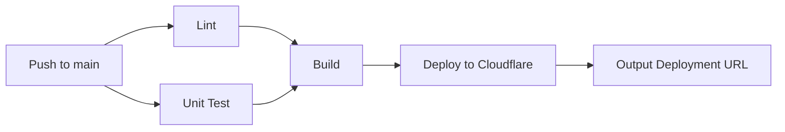

# Konfiguracja Cloudflare Pages Deployment

**Data utworzenia:** 2026-01-21  
**Status:** ✅ GOTOWE

---

## 📋 Podsumowanie Zmian

Projekt został skonfigurowany do automatycznego deploymentu na Cloudflare Pages poprzez GitHub Actions.

### Utworzone Pliki

1. **`.github/workflows/master.yml`** - Workflow CI/CD do deploymentu na Cloudflare Pages

---

## 🔧 Konfiguracja Wymagana

### 1. Sekrety GitHub (GitHub Secrets)

Przed uruchomieniem deploymentu należy dodać następujące sekrety w repozytorium GitHub:

**Lokalizacja:** `Settings` → `Secrets and variables` → `Actions` → `New repository secret`

| Nazwa Sekretu | Opis | Gdzie Znaleźć | Używane W |
|---------------|------|---------------|-----------|
| `CLOUDFLARE_API_TOKEN` | Token API Cloudflare | [Cloudflare Dashboard](https://dash.cloudflare.com/profile/api-tokens) → Create Token → Edit Cloudflare Workers (Template) | Deploy job |
| `CLOUDFLARE_ACCOUNT_ID` | ID konta Cloudflare | Cloudflare Dashboard → Workers & Pages → Overview (w prawym bocznym panelu) | Deploy job |
| `SUPABASE_URL` | URL projektu Supabase | Supabase Dashboard → Project Settings → API → Project URL | Build job |
| `SUPABASE_KEY` | Klucz API Supabase (anon/public) | Supabase Dashboard → Project Settings → API → anon/public key | Build job |
| `OPENROUTER_API_KEY` | Klucz API OpenRouter | [OpenRouter Dashboard](https://openrouter.ai/keys) | Build job |

**⚠️ WAŻNE:** Zmienne `SUPABASE_URL`, `SUPABASE_KEY` i `OPENROUTER_API_KEY` są używane podczas buildu Astro. Aby działały w production na Cloudflare Pages, **musisz je również dodać w Cloudflare Dashboard** (patrz sekcja poniżej).

### 2. Tworzenie Cloudflare API Token

1. Przejdź do [Cloudflare API Tokens](https://dash.cloudflare.com/profile/api-tokens)
2. Kliknij `Create Token`
3. Wybierz szablon `Edit Cloudflare Workers`
4. **Lub** użyj `Custom Token` z następującymi uprawnieniami:
   - **Account** → `Cloudflare Pages` → `Edit`
   - **Account** → `Workers Scripts` → `Edit` (opcjonalne)
5. **Zone Resources**: Include → All zones from an account → (Wybierz swoje konto)
6. Kliknij `Continue to summary` → `Create Token`
7. **Zapisz token** - nie będzie możliwe ponowne jego wyświetlenie!

### 3. Zmienne Środowiskowe w Cloudflare Pages (WYMAGANE!)

Po utworzeniu projektu Cloudflare Pages, **musisz dodać zmienne środowiskowe** aby aplikacja działała poprawnie w production.

**Lokalizacja:** [Cloudflare Dashboard](https://dash.cloudflare.com) → Workers & Pages → 10x-cards → Settings → Environment variables

**Dodaj następujące zmienne dla środowiska `Production`:**

| Nazwa Zmiennej | Wartość | Typ |
|----------------|---------|-----|
| `SUPABASE_URL` | (URL projektu Supabase) | Plain text |
| `SUPABASE_KEY` | (Klucz anon/public Supabase) | Encrypted (zalecane) |
| `OPENROUTER_API_KEY` | (Klucz API OpenRouter) | Encrypted (zalecane) |

**Kroki:**
1. Przejdź do Cloudflare Dashboard → Workers & Pages
2. Kliknij na projekt `10x-cards`
3. Przejdź do `Settings` → `Environment variables`
4. W sekcji `Production` kliknij `Add variable`
5. Dodaj każdą zmienną osobno
6. Dla `SUPABASE_KEY` i `OPENROUTER_API_KEY` zaznacz opcję `Encrypt`
7. Kliknij `Save`

**⚠️ Bez tych zmiennych aplikacja nie będzie działać w production!**

### 4. Utworzenie Projektu Cloudflare Pages

**Opcja A: Przez Dashboard (Rekomendowane dla pierwszego deploymentu)**

1. Przejdź do [Cloudflare Dashboard](https://dash.cloudflare.com) → `Workers & Pages`
2. Kliknij `Create application` → `Pages` → `Connect to Git`
3. Wybierz repozytorium `10x-cards`
4. **Build settings:**
   - Framework preset: `Astro`
   - Build command: `npm run build`
   - Build output directory: `dist`
5. Kliknij `Save and Deploy` (zmienne środowiskowe dodasz później zgodnie z sekcją 3)

**Opcja B: GitHub Actions zrobi to automatycznie**

Po dodaniu sekretów GitHub i zmiennych w Cloudflare Dashboard, workflow automatycznie wykona deployment przy pushu do brancha `main`.

**UWAGA:** Niezależnie od wybranej opcji, **musisz ręcznie dodać zmienne środowiskowe w Cloudflare Dashboard** (patrz sekcja 3 powyżej)!

---

## 🚀 Workflow CI/CD

### Trigger

Workflow uruchamia się automatycznie przy:
- `git push` do brancha `main`

### Etapy (Jobs)

1. **Lint** - Sprawdzenie jakości kodu (ESLint)
2. **Unit Test** - Uruchomienie testów jednostkowych z coverage
3. **Build** - Budowanie projektu Astro
4. **Deploy** - Deployment na Cloudflare Pages

### Diagram Przepływu



---

## 📊 Różnice względem `pull-request.yml`

| Aspekt | pull-request.yml | master.yml |
|--------|------------------|------------|
| **Trigger** | Pull Request do `main` | Push do `main` |
| **Testy E2E** | ❌ Brak | ❌ Brak |
| **Build** | ❌ Brak | ✅ Tak |
| **Deployment** | ❌ Brak | ✅ Cloudflare Pages |
| **Status Comment** | ✅ Tak | ❌ Brak |
| **Coverage Report** | ✅ Upload artifact | ✅ Upload artifact |

---

## 🔍 Weryfikacja Konfiguracji

### Sprawdzenie Sekretów GitHub

```bash
# Nie można sprawdzić wartości sekretów, ale można zweryfikować czy są ustawione
# poprzez sprawdzenie Actions logs w pierwszym uruchomieniu
```

### Test Lokalny Przed Deploymentem

```bash
# 1. Zainstaluj Wrangler CLI
npm install -g wrangler

# 2. Zaloguj się do Cloudflare
wrangler login

# 3. Zbuduj projekt
npm run build

# 4. Przetestuj lokalnie
wrangler pages dev ./dist

# 5. Deploy ręcznie (opcjonalnie)
wrangler pages deploy dist --project-name=10x-cards
```

---

## 🎯 Pierwsze Uruchomienie

### Kroki

1. **Dodaj sekrety GitHub** (patrz sekcja "Sekrety GitHub")
2. **Dodaj zmienne środowiskowe w Cloudflare Dashboard** (patrz sekcja "Zmienne Środowiskowe w Cloudflare Pages")
   - **KRYTYCZNE:** Bez tych zmiennych aplikacja nie będzie działać!
3. **Commituj i pushuj workflow:**
   ```bash
   git add .github/workflows/master.yml
   git commit -m "Add Cloudflare Pages deployment workflow"
   git push origin main
   ```
4. **Obserwuj workflow:**
   - Przejdź do `Actions` w repozytorium GitHub
   - Kliknij na najnowszy workflow run
   - Sprawdź logi każdego job'a
5. **Sprawdź deployment URL:**
   - Po zakończeniu job'a `deploy` sprawdź `Summary`
   - URL będzie w formacie: `https://10x-cards.pages.dev`

---

## ⚠️ Znane Problemy i Rozwiązania

### Problem: "Failed to upload secrets"

**Objaw:** 
```
🔑 Uploading secrets...
Error: Failed to upload secrets.
Error: 🚨 Action failed
```

**Przyczyna:** Parametr `secrets:` w `wrangler-action` jest przeznaczony tylko dla Cloudflare Workers, nie dla Pages.

**Rozwiązanie:**
- ✅ **NAPRAWIONE** - Usunięto parametr `secrets:` z workflow
- Zmienne środowiskowe dla Cloudflare Pages **muszą być skonfigurowane w Cloudflare Dashboard**
- Zobacz sekcję "Zmienne Środowiskowe w Cloudflare Pages"

### Problem: "Missing API Token"

**Objaw:** Job `deploy` kończy się błędem "Missing API Token"

**Rozwiązanie:**
- Upewnij się, że sekret `CLOUDFLARE_API_TOKEN` jest ustawiony w GitHub Secrets
- Sprawdź czy token nie wygasł (Cloudflare Dashboard → API Tokens)
- Wygeneruj nowy token jeśli to konieczne

### Problem: "Invalid binding 'SESSION'"

**Objaw:** Warning podczas buildu o brakującym binding SESSION

**Rozwiązanie:**
Obecnie aplikacja nie używa sesji KV, więc warning można zignorować. Jeśli chcesz go usunąć, dodaj do `wrangler.toml`:

```toml
[[kv_namespaces]]
binding = "SESSION"
id = "your-kv-namespace-id"
```

### Problem: "Project not found: 10x-cards"

**Objaw:** Job `deploy` kończy się błędem "Project not found"

**Rozwiązanie:**
- Projekt Cloudflare Pages musi istnieć przed pierwszym deploymentem przez Wrangler
- Utwórz projekt ręcznie przez Dashboard (patrz sekcja "Utworzenie Projektu Cloudflare Pages")
- **Lub** zmodyfikuj command w workflow na `pages deploy dist --project-name=10x-cards --branch=main`

---

## 📚 Dodatkowe Zasoby

- [Cloudflare Pages Documentation](https://developers.cloudflare.com/pages/)
- [Wrangler CLI Documentation](https://developers.cloudflare.com/workers/wrangler/)
- [GitHub Actions Documentation](https://docs.github.com/en/actions)
- [Astro Cloudflare Adapter](https://docs.astro.build/en/guides/integrations-guide/cloudflare/)

---

## 🔄 Kolejne Kroki (Opcjonalne)

### 1. Preview Deployments dla Pull Requests

Możesz rozszerzyć `pull-request.yml` o preview deployment:

```yaml
- name: Deploy Preview to Cloudflare Pages
  uses: cloudflare/wrangler-action@v3
  with:
    apiToken: ${{ secrets.CLOUDFLARE_API_TOKEN }}
    accountId: ${{ secrets.CLOUDFLARE_ACCOUNT_ID }}
    command: pages deploy dist --project-name=10x-cards --branch=pr-${{ github.event.pull_request.number }}
```

### 2. Automatyczne Testy E2E po Deploymencie

```yaml
- name: Run E2E tests against deployment
  run: |
    export PLAYWRIGHT_TEST_BASE_URL=${{ steps.deploy.outputs.deployment-url }}
    npm run test:e2e
```

### 3. Slack/Discord Notifications

```yaml
- name: Notify on Slack
  uses: slackapi/slack-github-action@v1
  with:
    webhook-url: ${{ secrets.SLACK_WEBHOOK }}
    payload: |
      {
        "text": "Deployment successful: ${{ steps.deploy.outputs.deployment-url }}"
      }
```

---

**Podsumowanie:** Workflow jest gotowy do użycia. Po dodaniu sekretów GitHub i pushu do brancha `main`, deployment na Cloudflare Pages rozpocznie się automatycznie.
