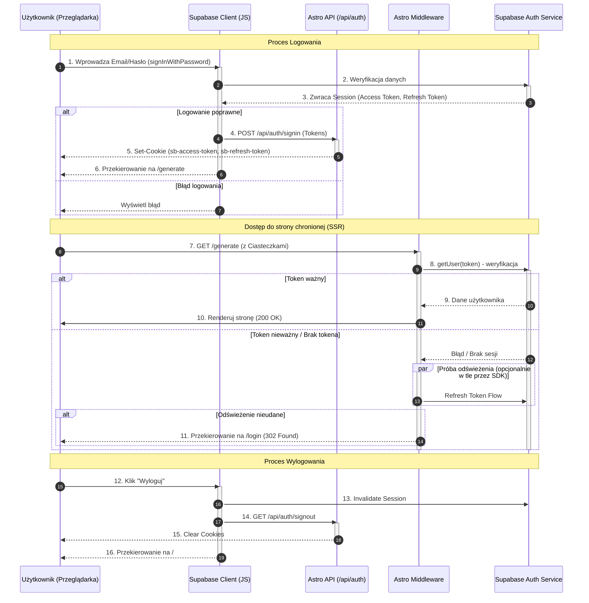

<authentication_analysis>
1.  **Przepływy autentykacji:**
    *   Logowanie email/hasło.
    *   Rejestracja z potwierdzeniem email.
    *   Synchronizacja sesji klienta z serwerem (Cookie Management).
    *   Ochrona tras (Middleware).
    *   Wylogowanie.

2.  **Aktorzy:**
    *   **User/Browser:** Interfejs użytkownika, formularze.
    *   **Supabase Client (Browser):** Biblioteka JS w przeglądarce.
    *   **Astro API (`/api/auth`):** Endpointy do ustawiania ciasteczek.
    *   **Middleware:** Warstwa pośrednia Astro na serwerze.
    *   **Supabase Auth:** Zewnętrzna usługa autentykacji.

3.  **Weryfikacja i Odświeżanie:**
    *   Tokeny Access i Refresh są przechowywane w ciasteczkach.
    *   Middleware sprawdza ważność Access Tokena przy każdym żądaniu do chronionej trasy.
    *   Supabase Client (Server) automatycznie odświeża tokeny używając Refresh Tokena jeśli Access Token wygasł.

4.  **Opis kroków (skrót):**
    *   Użytkownik wypełnia formularz -> Supabase zwraca sesję -> Frontend wysyła sesję do API -> API ustawia ciasteczka -> Następuje przekierowanie lub przeładowanie -> Middleware widzi ciasteczka i wpuszcza użytkownika.
</authentication_analysis>

