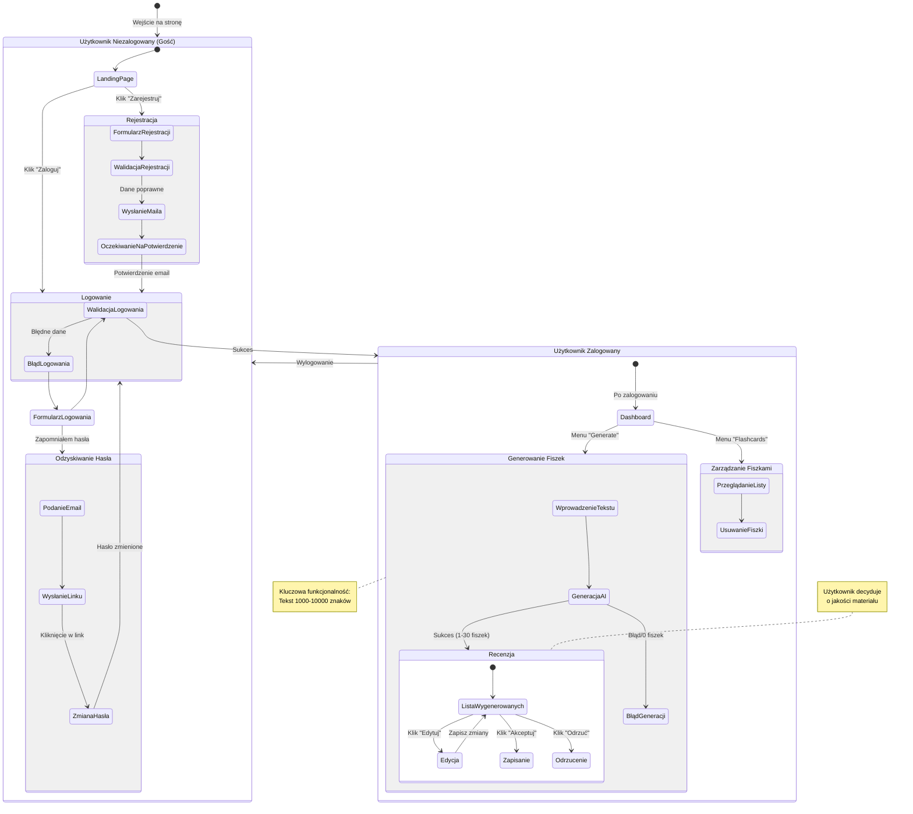

<user_journey_analysis>

1.  **Ścieżki użytkownika (z PRD i Auth Spec):**
    - Wejście na stronę jako gość.
    - Rejestracja nowego konta.
    - Logowanie do istniejącego konta.
    - Odzyskiwanie zapomnianego hasła.
    - Generowanie fiszek (tylko zalogowany).
    - Przeglądanie i zarządzanie fiszkami (tylko zalogowany).
    - Wylogowanie.

2.  **Główne podróże i stany:**
    - **Gość:** Landing Page, Login, Register, Forgot Password.
    - **Zalogowany:** Dashboard (Generate), My Flashcards, Settings (Logout).

3.  **Punkty decyzyjne:**
    - Czy użytkownik ma konto? (Tak -> Login, Nie -> Register).
    - Czy dane logowania poprawne?
    - Czy generowanie udane?
    - Decyzja przy recenzji fiszki (Akceptuj/Odrzuć/Edytuj).

4.  **Cel stanów:**
    _ **Landing Page:** Zachęta do rejestracji/logowania.
    _ **Login/Register:** Uzyskanie dostępu.
    _ **Generate View:** Główna wartość (tworzenie).
    _ **Review:** Kontrola jakości. \* **Saved List:** Przechowywanie wiedzy.
    </user_journey_analysis>

<mermaid_diagram>

