<architecture_analysis>
1.  **Komponenty (z PRD i Auth Spec):**
    *   **Strony (Astro Pages):**
        *   `index.astro` (Strona główna/Landing)
        *   `login.astro` (Logowanie)
        *   `register.astro` (Rejestracja)
        *   `forgot-password.astro` (Odzyskiwanie hasła)
        *   `generate.astro` (Generowanie fiszek - chroniona)
        *   `flashcards.astro` (Lista fiszek - chroniona)
    *   **Layouty:**
        *   `Layout.astro` (Główny layout z nawigacją)
        *   `AuthLayout` (Opcjonalny, uproszczony dla stron auth)
    *   **Komponenty Nawigacyjne:**
        *   `NavigationBar.tsx` (Górny pasek, stan zalogowania)
        *   `LeftNavigation.tsx` (Boczny pasek, linki)
        *   `HamburgerMenu.tsx` (Mobilne menu)
    *   **Komponenty Auth (React Islands):**
        *   `LoginForm.tsx`
        *   `RegisterForm.tsx`
        *   `ForgotPasswordForm.tsx`
        *   `ResetPasswordForm.tsx`
    *   **Komponenty Funkcjonalne (React Islands):**
        *   `GenerateView.tsx`
        *   `FlashcardsReviewList.tsx`
        *   `SavedFlashcardsList.tsx`
    *   **Serwisy/Logika:**
        *   `middleware/index.ts` (Ochrona tras, wstrzykiwanie sesji)
        *   `lib/supabase/client.ts` (Klient przeglądarkowy)
        *   `lib/supabase/server.ts` (Klient serwerowy)

2.  **Główne strony i komponenty:**
    *   `login.astro` zawiera `LoginForm.tsx`
    *   `register.astro` zawiera `RegisterForm.tsx`
    *   `generate.astro` zawiera `GenerateView.tsx` i `FlashcardsReviewList.tsx`
    *   `flashcards.astro` zawiera `SavedFlashcardsList.tsx`

3.  **Przepływ danych:**
    *   Middleware weryfikuje sesję i przekazuje obiekt `user` do `Layout.astro` via `Astro.locals`.
    *   `Layout.astro` przekazuje stan zalogowania do `NavigationBar` i `LeftNavigation`.
    *   Komponenty React (`LoginForm`, etc.) komunikują się bezpośrednio z Supabase Auth i wewnętrznym API (`/api/auth/*`) w celu synchronizacji ciasteczek.

4.  **Opis funkcjonalności:**
    *   **Layout:** Odpowiada za strukturę i nawigację, dostosowuje się do stanu autentykacji.
    *   **Auth Pages:** Kontenery dla formularzy React, renderowane SSR.
    *   **Auth Forms:** Obsługują interakcję z użytkownikiem i Supabase Auth.
    *   **Middleware:** Strażnik dostępu, zarządza sesją po stronie serwera.

```mermaid
flowchart TD
    subgraph "Warstwa Serwera (Astro SSR)"
        Middleware[Middleware]
        
        subgraph "Layouts"
            MainLayout[Layout.astro]
            AuthLayout[AuthLayout]
        end

        subgraph "Strony Publiczne"
            IndexPage[index.astro]
            LoginPage[login.astro]
            RegisterPage[register.astro]
            ForgotPage[forgot-password.astro]
        end

        subgraph "Strony Chronione"
            GeneratePage[generate.astro]
            FlashcardsPage[flashcards.astro]
        end
        
        API[API Endpoints\n/api/auth/*]
    end

    subgraph "Warstwa Klienta (React Islands)"
        subgraph "Komponenty Auth"
            LoginForm[LoginForm.tsx]
            RegisterForm[RegisterForm.tsx]
            ForgotForm[ForgotPasswordForm.tsx]
            ResetForm[ResetPasswordForm.tsx]
        end

        subgraph "Komponenty Nawigacyjne"
            NavBar[NavigationBar.tsx]
            SideNav[LeftNavigation.tsx]
            MobMenu[HamburgerMenu.tsx]
        end

        subgraph "Komponenty Funkcjonalne"
            GenView[GenerateView.tsx]
            ReviewList[FlashcardsReviewList.tsx]
            SavedList[SavedFlashcardsList.tsx]
        end

        SupabaseClient[Supabase Client Browser]
    end

    %% Połączenia Middleware i Stron
    Middleware -->|Weryfikacja Sesji| MainLayout
    Middleware -.->|Przekierowanie brak sesji| LoginPage
    
    %% Relacje Layout - Strony
    MainLayout --> IndexPage
    MainLayout --> GeneratePage
    MainLayout --> FlashcardsPage
    
    AuthLayout --> LoginPage
    AuthLayout --> RegisterPage
    AuthLayout --> ForgotPage

    %% Relacje Strony - Komponenty
    LoginPage --> LoginForm
    RegisterPage --> RegisterForm
    ForgotPage --> ForgotForm
    
    GeneratePage --> GenView
    GenView --> ReviewList
    FlashcardsPage --> SavedList

    %% Relacje Layout - Nawigacja
    MainLayout --> NavBar
    MainLayout --> SideNav
    NavBar --> MobMenu

    %% Interakcje Auth
    LoginForm -->|SignIn| SupabaseClient
    RegisterForm -->|SignUp| SupabaseClient
    ForgotForm -->|ResetPassword| SupabaseClient
    
    %% Synchronizacja Sesji
    SupabaseClient -->|Token| API
    API -->|Set Cookie| Middleware

    %% Style
    classDef server fill:#e1f5fe,stroke:#01579b,stroke-width:2px;
    classDef client fill:#fff3e0,stroke:#e65100,stroke-width:2px;
    classDef auth fill:#fce4ec,stroke:#880e4f,stroke-width:2px;

    Middleware,MainLayout,AuthLayout,IndexPage,LoginPage,RegisterPage,ForgotPage,GeneratePage,FlashcardsPage,API:::server
    NavBar,SideNav,MobMenu,GenView,ReviewList,SavedList,SupabaseClient:::client
    LoginForm,RegisterForm,ForgotForm,ResetForm:::auth
```

</architecture_analysis>

